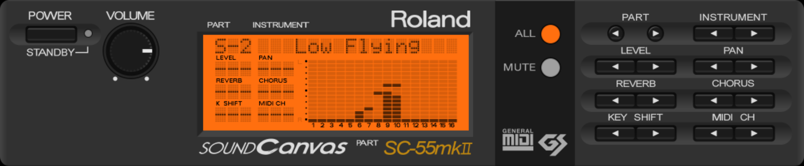

# Nuked SC-55

Fork of [nukeykt/Nuked-SC55](https://github.com/nukeykt/Nuked-SC55) with
the optimization work of jcmoyer [jcmoyer/Nuked-SC55](https://github.com/jcmoyer/Nuked-SC55)
and GUI code work of kebufu [mckuhei/Nuked-SC55](https://github.com/mckuhei/Nuked-SC55).

Differences from upstream:

- Produces a library for the emulator.
- Standard frontend supports routing to multiple emulators to raise polyphony
  limits.
- Includes a MIDI-to-WAVE rendererer.
- Adds tests so that the backend can be modified without worrying about
  breaking things.
- Command line is handled slightly differently. Pass `--help` to a binary to
  see what arguments it accepts.
- Improved performance without sacrificing accuracy.
- Added GUI support and LCD Contrast.
- Added Serial MIDI support for mkII and st models.
- Added Remote Control support for mkI, mkII, SC-155 and SC-155mkII models.
- Added volume adjustment.
- Support for ASIO output on Windows when building from source.
- Loads roms based on their hashes instead of requiring specific filenames.

## Downloads 

Windows Builds can be downloaded from here: [Releases](https://github.com/linoshkmalayil/Nuked-SC55-GUI-Float/releases/)\
Latest Build: [Latest](https://github.com/linoshkmalayil/Nuked-SC55-GUI-Float/releases/latest)

Linux and Mac requires building from source. (See [BUILDING](README.md#building))

## Building

See [BUILDING.md](documentation/BUILDING.md).

## Usage

See [USAGE.md](documentation/USAGE.md).

## Changelog

See [CHANGELOG.md](documentation/CHANGELOG.md).

## Contributing

See [CONTRIBUTING.md](documentation/CONTRIBUTING.md).

## License

Nuked SC-55 can be distributed and used under the original [MAME LICENSE](LICENSE). 
Non-commercial license was chosen to prevent making and selling SC-55 emulation 
boxes using (or around) this code, as well as preventing from using it in the 
commercial music production.

## Thanks

The work on this fork is due the contribution of the following people:

### Contributors on the Original Nuked-SC55 Emulator:
- John McMaster: SC-55 PCM chip decap.
- org/ogamespec: deroute tool.
- SDL team.
- Wohlstand: linux/macos port.
- mattw.
- HardWareMan.
- giulioz: JV-880 support
- Cloudschatze.
- NikitaLita.
- Karmeck.

### This fork is based on the work of the contributors:
- [jcmoyer](https://github.com/jcmoyer)
- [mckuhei](https://github.com/mckuhei)/[kebufu](https://github.com/kebufu)
- [Grieferus](https://github.com/Grieferus) (GUI Design)
